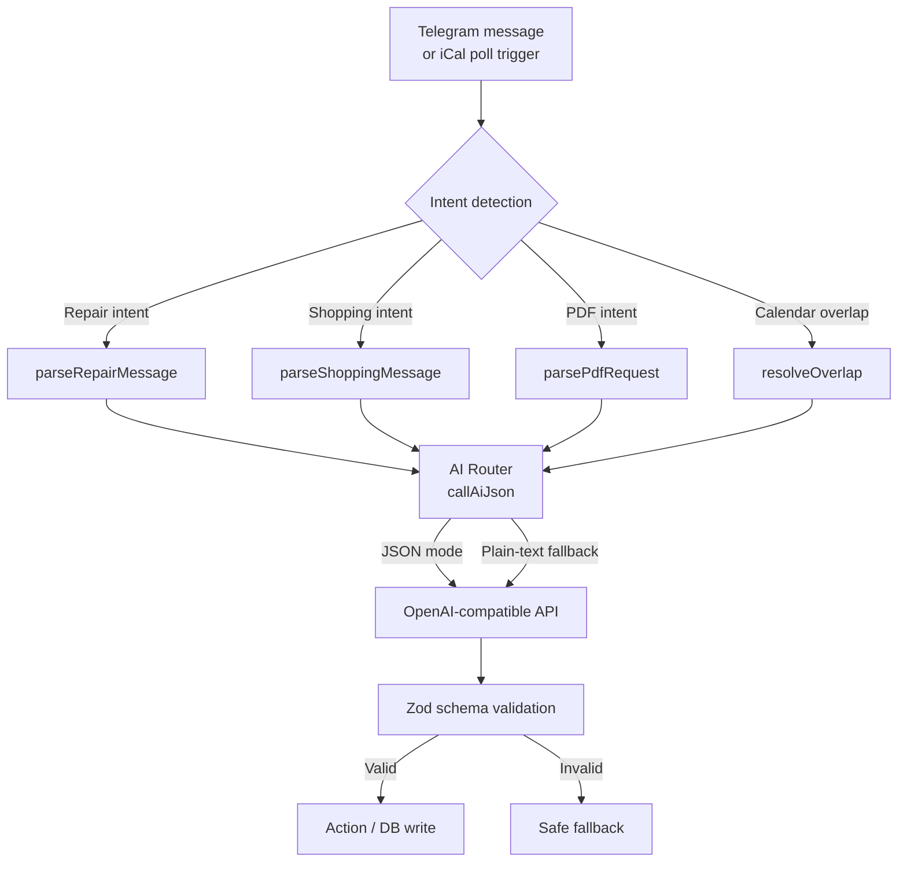

# AI Integration

Rental Buddy uses a small, provider-agnostic AI layer to handle ambiguity that deterministic rules cannot resolve. Every AI call is wrapped in defensive fallbacks so that a provider outage, malformed response, or schema mismatch never crashes the app or corrupts data.

---

## Architecture Overview



---

## AI Router

**File:** `packages/ai/src/router.ts`

The router is a thin, lazy-initialized wrapper around the `openai` SDK. It is designed so that packages can import `@app/ai` at build time without requiring environment variables to be present.

### Lazy initialization

```ts
let client: OpenAI | null = null;

export function getAiClient(): OpenAI {
  if (client) return client;
  const apiKey = process.env.OPENAI_API_KEY;
  const baseURL = process.env.OPENAI_BASE_URL ?? 'https://opencode.ai/zen/v1';
  if (!apiKey) throw new Error('[ai] OPENAI_API_KEY is not set');
  client = new OpenAI({ apiKey, baseURL });
  return client;
}
```

### `callAiJson`

Tries JSON mode first. If the provider rejects the `response_format` parameter (some OpenAI-compatible endpoints do), it automatically retries as plain text.

```ts
export async function callAiJson(
  messages: Array<{ role: 'system' | 'user'; content: string }>,
  options?: { temperature?: number },
): Promise<{ raw: string; usedJsonMode: boolean }> {
  // 1. Try with JSON mode
  // 2. Fallback: plain text
}
```

### `cleanJson`

Strips markdown code fences so downstream parsers never choke on ` ```json ` wrappers.

```ts
export function cleanJson(raw: string): string {
  return raw
    .replace(/^```(?:json)?\s*/i, '')
    .replace(/\s*```$/i, '')
    .trim();
}
```

---

## Task: Calendar Overlap Resolution

**File:** `packages/ai/src/tasks/resolve-overlap.ts`  
**Caller:** `apps/worker/src/jobs/poll-ical.ts`

### What it does

When two calendar events overlap ambiguously (not an exact duplicate or a known Airbnb same-day block), the AI decides whether to suppress one reservation, keep both, or flag the conflict for human review.

### Deterministic pre-filtering

The overlap pipeline runs three deterministic rules **before** invoking AI:

| Rule | Condition | Action |
|------|-----------|--------|
| R1 — Exact duplicate | Same start/end dates, multiple reservations | Keep longest summary, suppress rest |
| R2 — Airbnb same-day block | One event is `BLOCKED` and overlaps a `CONFIRMED` stay on the same day | Suppress the block |
| R3 — Block vs Confirmed | One `BLOCKED`, one `CONFIRMED`, different dates | Suppress the block |

Only overlaps that survive R1–R3 reach `resolveOverlap`.

### Prompt

```
You are an AI channel manager for short-term rental properties.
The following calendar events overlap. Decide how to resolve the conflict.

<Event 1 details>

<Event 2 details>

Decision rules (pick the single best option):
1. KEEP_BOTH — Use when both events are legitimate and the overlap is acceptable.
   Examples: one is a blocked cleaning/maintenance window, the other is a confirmed
   guest stay; or the property has multiple sub-units and each booking is for a
   different unit; or one is a host-blocked personal stay that overlaps with a
   platform block.

2. SUPPRESS — Use when one event is clearly a duplicate, test booking, lower-priority
   platform block, or calendar artifact that should be removed. You MUST include the
   `targetReservationId` of the event to suppress. The suppressed event will be hidden
   from the calendar but can be restored later if needed.

3. NEEDS_HUMAN — Use ONLY when you genuinely cannot tell which event is correct
   (e.g., both look like valid guest bookings with different names and no clear priority).

Return a JSON object with exactly these fields:
- action: "SUPPRESS" | "KEEP_BOTH" | "NEEDS_HUMAN"
- targetReservationId: string (required ONLY when action is "SUPPRESS")
- rationale: string (max 300 chars, explain in plain English why you chose this action)
```

### Output schema

```ts
export const OverlapResolutionSchema = z.object({
  action: z.enum(['SUPPRESS', 'KEEP_BOTH', 'NEEDS_HUMAN']),
  targetReservationId: z.string().optional(),
  rationale: z.string().min(1).max(500),
});
```

### Fallback behavior

On any error (API down, invalid JSON, schema mismatch) the function returns:

```ts
{
  action: 'NEEDS_HUMAN',
  rationale: 'AI unavailable; manual review needed.',
}
```

The caller then stores this as an `AI_PROPOSED` decision, creates a `WARNING` notification, and sends a Telegram alert with **Accept / Revert** buttons.

---

## Task: Shopping Item Extraction

**File:** `packages/ai/src/tasks/parse-shopping.ts`  
**Caller:** `apps/worker/src/telegram/bot.ts`

### What it does

Extracts shopping items from free-text Telegram messages such as:

> "Buy for Triplex: 2x MALM bed frame, 6 cups"

### System prompt

The prompt injects:

1. **Property list** — available properties with IDs so the AI can resolve "Triplex" to a database ID.
2. **IKEA catalog** — 40+ hardcoded IKEA Portugal products with exact names, article numbers, and unit prices.
3. **Fuzzy matching rules** — e.g. "cups" → `GODIS glass`, "towels" → `VÅGSJÖN bath towel`.
4. **Quantity parsing** — "2x", "two", "a" are all valid.

Key excerpt:

```
2. For each item the user wants to buy:
   - qty: quantity the user wants (default 1)
   - Look up the EXACT product in the IKEA catalog below.
     Match the user's generic description to the closest catalog entry.
   - name: MUST be the EXACT catalog product name (e.g. "GODIS glass", not just "glass")
   - unitPrice: use the exact price from the catalog

3. If the user asks for something NOT in the catalog:
   - name: best IKEA product name you know
   - unitPrice: approximate price
```

### Output schema

```ts
export const ShoppingParseSchema = z.object({
  propertyId: z.string().nullable().optional().default(null),
  items: z.array(
    z.object({
      name: z.string().min(1),
      qty: z.coerce.number().int().positive(),
      unitPrice: z.coerce.number().positive().nullable().optional(),
      ikeaUrl: z.string().url().optional(),
    }),
  ).min(0),
});
```

### Fallback behavior

```ts
{ propertyId: null, items: [] }
```

If the AI returns empty or invalid results, the Telegram bot falls back to a regex-based parser (`parseShoppingFallback`) that tries to extract property + items with simple string splitting.

---

## Task: PDF Request Parsing

**File:** `packages/ai/src/tasks/parse-pdf-request.ts`  
**Caller:** `apps/worker/src/telegram/bot.ts`

### What it does

Interprets natural-language PDF requests such as:

> "check-in form for May 11"  
> "send me the schedule for this month"

### System prompt

The prompt includes:

- **Today's date** — so relative references like "this month" resolve correctly.
- **Property list** — to narrow reservations when a property name is mentioned.
- **Reservation list** — upcoming reservations with IDs, dates, and summaries so the AI can match a date to a specific reservation.

Decision types:

| Type | Trigger phrases | Output fields |
|------|-----------------|---------------|
| `CHECKIN` | "check-in form for May 11", "checkin pdf" | `reservationId` |
| `SCHEDULE` | "schedule for this month", "calendar pdf", "full schedule" | `referenceDate`, `windowDays` (default 30) |
| `UNKNOWN` | Unrecognized request | all fields `null` |

### Output schema

```ts
export const PdfRequestSchema = z.object({
  type: z.enum(['CHECKIN', 'SCHEDULE', 'UNKNOWN']),
  propertyId: z.string().nullable().optional().default(null),
  reservationId: z.string().nullable().optional(),
  referenceDate: z.string().regex(/^\d{4}-\d{2}-\d{2}$/).nullable().optional(),
  windowDays: z.coerce.number().int().min(1).max(180).nullable().optional(),
});
```

### Fallback behavior

```ts
{ type: 'UNKNOWN', propertyId: null }
```

The Telegram bot has a secondary `parseScheduleFallback` that detects schedule keywords with a simple regex and returns the current month's schedule if the AI returns `UNKNOWN`.

---

## Task: Repair Request Parsing

**File:** `packages/ai/src/tasks/parse-repair.ts`  
**Caller:** `apps/worker/src/telegram/bot.ts`

### What it does

Extracts repair descriptions from messages like:

> "Repair triplex bathroom door"

and generates a cost estimate broken into line items for Portugal (Lisbon area).

### System prompt

Key rules injected into the prompt:

1. Identify property from the provided list.
2. Extract the repair description (e.g. "bathroom door", "leaking faucet").
3. Generate a realistic cost estimate with line items:
   - **MATERIALS** — approximate cost of parts
   - **LABOR** — handyman rates in Portugal: €25–40/hour
   - **OTHER** — transport, disposal, call-out fees
4. Each line item has `name`, `cost` (EUR), and `category`.

### Output schema

```ts
export const RepairLineItemSchema = z.object({
  name: z.string().min(1),
  cost: z.coerce.number().positive(),
  category: z.enum(['MATERIALS', 'LABOR', 'OTHER']),
});

export const RepairParseSchema = z.object({
  propertyId: z.string().nullable().optional().default(null),
  description: z.string().min(1),
  lineItems: z.array(RepairLineItemSchema).min(1),
});
```

### Fallback behavior

```ts
{ propertyId: null, description: '', lineItems: [] }
```

The Telegram bot falls back to `parseRepairFallback`, which uses keyword regexes to categorize repairs (door, leak, window, etc.) and applies hardcoded default line items.

---

## Task: Check-In Data Extraction

**File:** `packages/ai/src/tasks/extract-checkin.ts`  
**Caller:** Planned for Phase 5 (not yet wired to Telegram)

### Status

**Stub implementation.** Currently uses rule-based regex to extract guest name and country from forwarded messages:

```ts
const nameMatch = text.match(/name[:\s]+([A-Z][a-zA-Z'\- ]{1,80})/i);
const countryMatch = text.match(/country[:\s]+([A-Za-z ]{2,40})/i);
```

### Future plan

Replace the stub with a full AI prompt + JSON-mode call that extracts:
- Full name
- Country of residence
- Citizen ID / passport number
- Date of birth

from unstructured guest messages or booking-platform confirmations.

---

## IKEA Live Search

**File:** `packages/ai/src/ikea-catalog.ts`

### Hybrid approach

The shopping flow uses AI for **natural-language understanding** and IKEA's internal search API for **ground-truth pricing and URLs**.

```mermaid
flowchart LR
    A[User: "2x MALM bed frame"] --> B[AI parseShoppingMessage]
    B --> C[Extract qty + product name]
    C --> D{Live IKEA API?}
    D -->|Success| E[Real-time price + URL]
    D -->|Fail| F[Hardcoded catalog price]
    E --> G[Save to DB + reply]
    F --> G
```

### Hardcoded catalog

`ikeaCatalog` contains 40+ IKEA Portugal products with article numbers and approximate retail prices (EUR) as of 2025. Categories covered: glasses, mugs, plates, cutlery, towels, bed frames, mattresses, bedding, duvets, pillows, storage, lighting, chairs, tables, kitchen, bathroom, and cleaning.

### Live search API

```ts
await fetch('https://sik.search.blue.cdtapps.com/pt/en/search', {
  method: 'POST',
  body: JSON.stringify({
    searchParameters: { input: query, type: 'QUERY' },
    components: [{ component: 'PRIMARY_AREA', columns: 4, types: { main: 'PRODUCT' }, window: { offset: 0, size: 5 } }],
  }),
});
```

Results are fuzzy-scored against the query tokens. The best match is returned with:
- `name` + `typeName`
- `unitPrice` + `currency`
- `articleNumber`
- `url`

If the live API fails or returns no match, the system falls back to the hardcoded catalog (`findIkeaProductByName`).

---

## Resilience Patterns

Every AI integration in Rental Buddy follows the same defensive contract:

| Pattern | Implementation |
|---------|----------------|
| **Lazy init** | `getAiClient()` only instantiates `OpenAI` on first call; packages can import without env vars |
| **JSON mode → plain text fallback** | `callAiJson` retries without `response_format` if the provider rejects it |
| **Markdown fence stripping** | `cleanJson` removes ` ```json ` wrappers before parsing |
| **Schema validation** | Every AI output is parsed through Zod before use |
| **Never hard-crash** | Every task is wrapped in `try/catch`; failures return safe defaults |
| **No secrets in prompts** | API keys, tokens, and database URLs are never injected into prompts |
| **Structured logging** | All AI calls log model name, raw response length, and mode used |

### Safe defaults matrix

| Task | Failure return |
|------|----------------|
| `resolveOverlap` | `{ action: 'NEEDS_HUMAN', rationale: 'AI unavailable; manual review needed.' }` |
| `parseShoppingMessage` | `{ propertyId: null, items: [] }` |
| `parsePdfRequest` | `{ type: 'UNKNOWN', propertyId: null }` |
| `parseRepairMessage` | `{ propertyId: null, description: '', lineItems: [] }` |
| `resolveIkeaProduct` (live API) | `null` → caller falls back to catalog |

---

## Configuration

```bash
# Required
OPENAI_API_KEY=sk-...

# Optional
OPENAI_BASE_URL=https://opencode.ai/zen/v1  # defaults to OpenCode Zen
AI_MODEL=big-pickle                           # defaults to big-pickle
```

These variables are read at runtime by `packages/ai/src/router.ts`. No build-time constants or checked-in keys are used.

---

## File Map

| File | Responsibility |
|------|----------------|
| `packages/ai/src/router.ts` | Provider-agnostic client, `callAiJson`, `cleanJson` |
| `packages/ai/src/tasks/resolve-overlap.ts` | Calendar overlap resolution |
| `packages/ai/src/tasks/parse-shopping.ts` | Shopping list extraction |
| `packages/ai/src/tasks/parse-pdf-request.ts` | PDF request interpretation |
| `packages/ai/src/tasks/parse-repair.ts` | Repair description + cost estimate |
| `packages/ai/src/tasks/extract-checkin.ts` | Check-in guest data extraction (stub) |
| `packages/ai/src/ikea-catalog.ts` | Hardcoded catalog + live IKEA search API |
| `apps/worker/src/jobs/poll-ical.ts` | iCal polling, deterministic rules, AI escalation |
| `apps/worker/src/telegram/bot.ts` | Intent detection, AI task calls, fallback parsers, PDF delivery |
| `packages/shared/src/index.ts` | Zod schemas: `OverlapResolutionSchema`, `ShoppingParseSchema`, `PdfRequestSchema`, `RepairParseSchema` |
